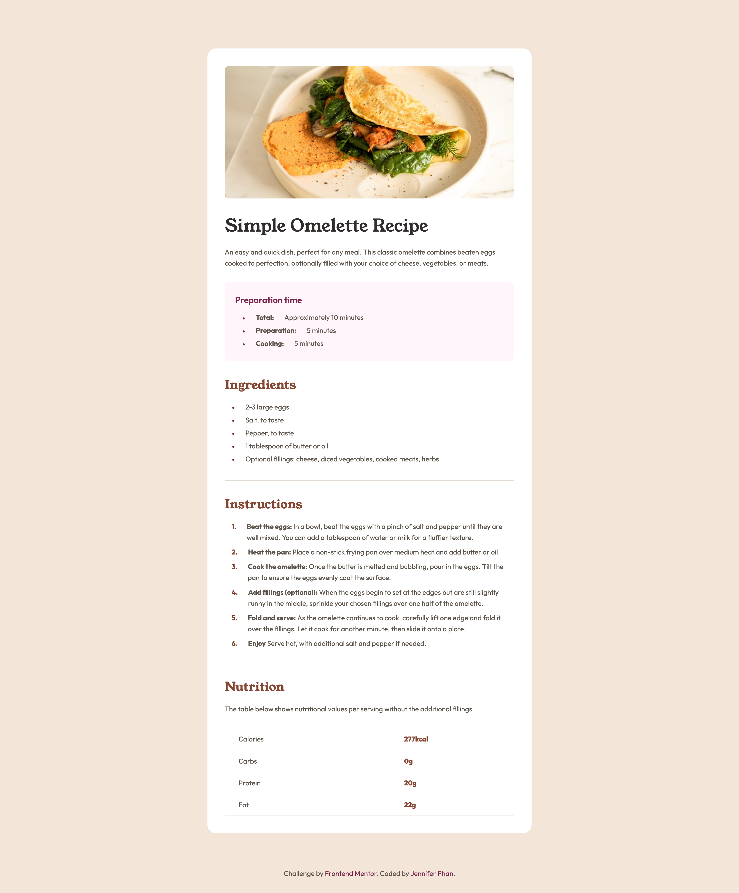

# Frontend Mentor - Recipe page solution

This is a solution to the [Recipe page challenge on Frontend Mentor](https://www.frontendmentor.io/challenges/recipe-page-KiTsR8QQKm). Frontend Mentor challenges help you improve your coding skills by building realistic projects. 

## Table of contents

- [Overview](#overview)
  - [The challenge](#the-challenge)
  - [Screenshot](#screenshot)
  - [Links](#links)
- [My process](#my-process)
  - [Built with](#built-with)
  - [What I learned](#what-i-learned)
  - [Continued development](#continued-development)
- [Author](#author)
## Overview

### Screenshot



### Links

- Solution URL: [Solution](https://www.frontendmentor.io/solutions/responsive-recipe-page-using-bem-flexbox-and-custom-list-styling-9-NtwvP_Ha)
- Live Site URL: [Live site](https://jenphan.github.io/Recipe-Page/)

## My process

### Built with

- Semantic HTML5 markup
- CSS custom properties 
- Flexbox for layout
- Mobile-first workflow
- BEM naming convention
- Responsive design via media queries

### What I learned

During this challenge, I focused on writing cleaner CSS using :root variables for consistent color, spacing, and typography. I also utilized BEM naming methodology to improve the structure of my CSS. I also replaced the native list styling with a custom flex-based layout using ::before and counter-increment to get the spacing closer to the original design.

```css
.recipe__instructions {
    list-style: none;
    padding-left: var(--spacing-sm);
    margin-top: 0.5rem;
    counter-reset: step-counter;
}

.recipe__instructions-item {
    display: flex;
    align-items: flex-start;
    gap: var(--spacing-md);
    counter-increment: step-counter;
    position: relative;
    margin-bottom: 0.5rem;
}

.recipe__instructions-item::before {
    content: counter(step-counter) ".";
    font-weight: 700;
    color: var(--clr-headings);
    text-align: right;
}
```

### Continued development

In future projects, I would like to incorporate more accessible and screen-reader-friendly list styling.

## Author

- Github - [@jenphan](https://www.github.com/jenphan)
- Frontend Mentor - [@jenphan](https://www.frontendmentor.io/profile/jenphan)
